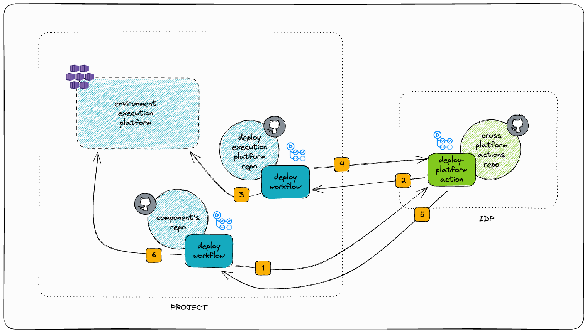

# Table of Contents

* [Usage](#usage)
  * [Assumptions](#assumptions)
  * [Versions](#versions)
  * [Example](#example)
  * [Inputs](#inputs)
  * [Outputs](#outputs)
  * [Debug mode](#debug-mode)
* [Development](#development)
  * [Requirements](#requirements)
  * [Branching model](#branching-model)
  * [Installation](#installation)
  * [Lint](#lint)
  * [Check spelling](#check-spelling)
  * [Check types](#check-types)
  * [Unit tests](#unit-tests)
  * [Build](#build)
  * [Component tests](#component-tests)
  * [Release](#release)
    * [Versioning](#versioning)
    * [Release process](#release-process)

# Usage

This action receives a project name, launches a deploy platform workflow in the corresponding project's platform repository, then it waits for the deploy action to finish and expect it to have uploaded a deploy manifest. Once the deploy workflow has completed successfully, this action returns the deploy manifest as an output.

__So, you can use this action in the project's components repositories to launch the deployment of the project's execution platform, and then get the deploy manifest to use it to deploy the components to the execution environment.__

[](./docs/architecture-diagram.png)

1. The component's deploy workflow launches this deploy platform action.
2. This action launches the deploy platform workflow in the project's platform repository.
3. The deploy platform workflow creates the environment in the execution platform and uploads the deploy manifest.
4. This action waits for the deploy platform workflow to finish.
5. This action gets the deploy manifest from the deploy platform workflow artifacts and returns it as an output.
6. The component's deploy workflow gets the deploy manifest from the output and uses it to deploy the components to the execution environment.

## Assumptions

- The target project has a repository named `${project}-platform`, with a deploy workflow named `deploy.yml`. This workflow should create an environment in the execution platform. It must have two inputs:
  * `environment` - Environment to create in the execution platform.
  * `id`: This is a random uuid generated by this action on each execution. You must name a step in your workflow with this id, so that this action can verify that the workflow is the one that was launched by this action.
- The deploy workflow creates a job with a step with `(${{github.event.inputs.id}})` as part of his name. This step will be used to verify that the workflow is the one that was launched by this action. 
- The deploy workflow uploads __only one__ artifact containing just the deployment JSON manifest file.

## Versions

To know more about how this action is versioned, read the monorepo [README](../README.md#versions).

## Example

Example of usage in a component repository:

```yaml
steps:
  - id: deploy-platform
    name: Deploy execution platform
    uses: Telefonica/cross-platform-actions/deploy-platform@{BRANCH_NAME|VERSION}
    with:
      project: $PROJECT_NAME
      environment: $ENVIRONMENT_NAME
      token: $TOKEN
  - name: Azure Login in the execution platform
    run: |
      az login \
        --password ${{ fromJSON(steps.deploy-platform.outputs.manifest).azure.credentials.client_secret }} \
        --service-principal \
        --tenant ${{ fromJSON(steps.deploy-platform.outputs.manifest).azure.credentials.tenant_id }} \
        --username ${{ fromJSON(steps.deploy-platform.outputs.manifest).azure.credentials.client_id }}
  - name: Docker Login in the execution deploy-platform
    run: |
      az acr login \
        --name ${{ fromJSON(steps.deploy-platform.outputs.manifest).registry.name }}
```

## Inputs

- `project` - Project name. This action will launch the deploy workflow in a repository with the name `${project}-platform`.
- `environment` - Environment to create. It will be passed as an input to the deploy workflow.
- `token` - Github token to get access to the repository workflows
- `ref` - _Optional_. Branch or tag in which to run the deploy workflow. If not specified, the `main` branch will be used.
- `repo-suffix` - _Optional_. Suffix to append to the project name to get the platform repository name. If not specified, `-platform` will be used.
- `workflow-id` - _Optional_. ID of the workflow to launch. If not specified, the first workflow with the name `deploy.yml` will be used.

## Outputs

- `manifest` - Manifest generated by the deploy workflow, as a JSON string.

## Debug mode

To enable the debug mode add a repository variable named `ACTIONS_STEP_DEBUG` and set its value to `true`. Debug mode is more verbose and it shows the response of the requests done to the github API.

# Development

## Requirements

Read the monorepo [README](../README.md#requirements) to know the requirements of this project.

## Branching model

This repository uses the trunk-based development branching model. The `main` branch is the main branch (surprise! 😜), and it must be always deployable. All the changes are done in feature branches, and they are merged into `main` using pull requests.

> Note: Even when the main branch should be always deployable, before [declaring a formal release](#release) it may be necessary to perform some manual steps, like updating the changelog or the version number. So, it is recommended to use a release branch to prepare the release.

## Installation

Read the monorepo [README](../README.md#development) to know how to install the monorepo dependencies, which automatically installs the dependencies of this package too.

## Lint

This project uses [ESLint](https://eslint.org/) to lint the code. To run it, execute:

```sh
pnpm run lint
```

It is recommended to install the [ESLint extension](https://marketplace.visualstudio.com/items?itemName=dbaeumer.vscode-eslint) for Visual Studio Code.

Eslint errors can be automatically fixed with `npm run lint:fix`.

## Check spelling

This project uses [cspell](https://github.com/streetsidesoftware/cspell) to check spelling in the code and documentation. To run it, execute:

```sh
pnpm run check:spelling
```

You can install the [CSpell extension](https://marketplace.visualstudio.com/items?itemName=streetsidesoftware.code-spell-checker) for Visual Studio Code to get spell checking in your editor.

## Check types

This project uses [TypeScript](https://www.typescriptlang.org/). You can check types with:

```sh
pnpm run check:types
```

## Unit tests

Unit tests are written with [Jest](https://jestjs.io/). To run them, execute:

```sh
pnpm run test
```

The coverage report will be generated in the `coverage` folder.

## Build

⚠️ __IMPORTANT__: For the moment, the project has to be built locally on every change, and the `dist` folder has to be committed to the repository. This is something that we will improve in the future. But, for now, there is a step in the test workflow that checks that the `dist` folder is up to date. So, remember to build the project before pushing your changes, otherwise the tests will fail.

To build the project and add the dist folder, execute:

```sh
pnpm run build

# Remember to add the built files!!
git add dist
```

## Component tests

Component tests are executed in a real environment, using the GitHub Actions Runner. The action is executed in the workflow, and it dispatches the `deploy-test.yml` workflow in this same repository. The `deploy-test.yml` workflow is a simple workflow that just uploads a fake manifest. The component tests check that the manifest is correctly downloaded by the action and passed as an output.

## Release

Read the monorepo [README](../README.md#release) to know how to release the monorepo, which automatically releases a new version of this action too.
